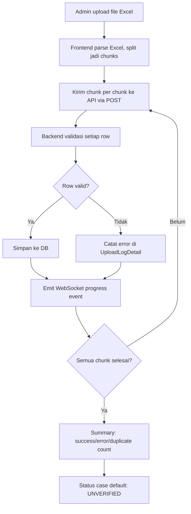
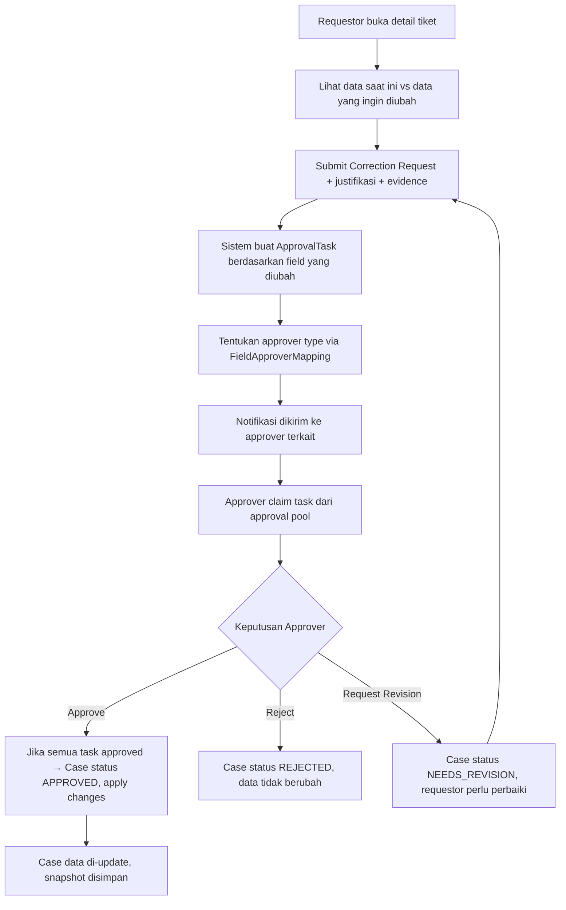
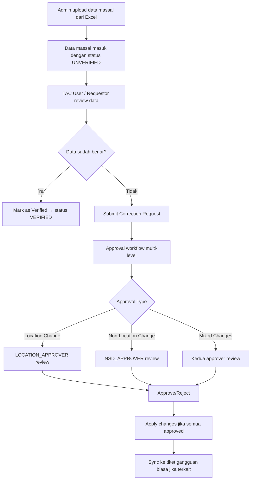
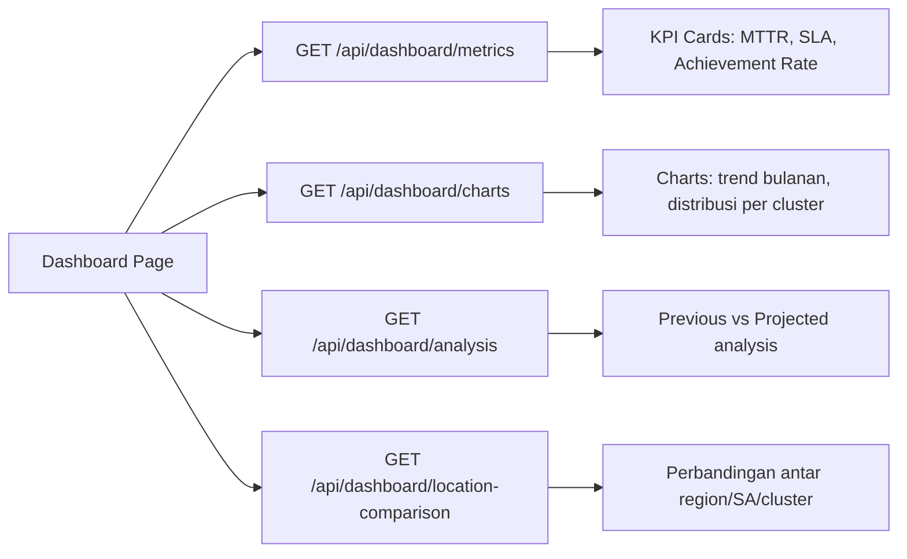
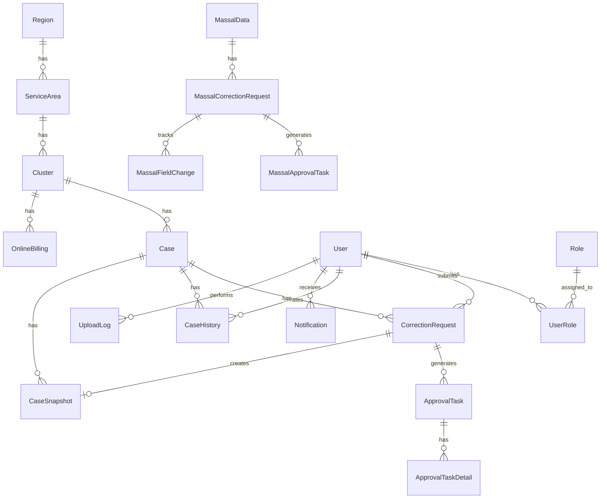

# 📋 Ringkasan Komprehensif Aplikasi DAISI (DESI)

> **Dokumen ini** merangkum seluruh seluk-beluk aplikasi DAISI berdasarkan analisis source code backend, frontend, database schema, dan konfigurasi deployment.

---

## 📖 1. Penjelasan Aplikasi

**DAISI** (juga disebut **DESI**) adalah **sistem manajemen tiket gangguan (case/incident management)** yang digunakan untuk mengelola, memverifikasi, dan mengkoreksi data gangguan layanan telekomunikasi. Aplikasi ini berfokus pada:

- **Manajemen Tiket Gangguan (Case)** — data gangguan layanan pelanggan
- **Manajemen Data Gangguan Massal (Massal)** — gangguan yang berdampak pada banyak layanan sekaligus
- **Online Billing** — data billing pelanggan yang terkait dengan layanan yang terganggu
- **Dashboard KPI & MTTR** — monitoring performa SLA dan Mean Time to Repair (MTTR)
- **Workflow Approval** — proses koreksi data yang memerlukan persetujuan multi-level

> [!NOTE]
> Nama "DAISI" dan "DESI" digunakan secara bergantian dalam codebase. Backend menggunakan nama `api-new-daisy`, frontend menggunakan `desi-new-final`.

---

## 🎯 2. Problem Statement

### Masalah Utama
| No | Problem | Dampak |
|----|---------|--------|
| 1  | Data gangguan dari sistem ticketing sering memiliki **kesalahan/inkonsistensi** (salah lokasi, salah media access, salah PJ gangguan, dll) | KPI dan MTTR tidak akurat, pelaporan manajemen menyesatkan |
| 2  | **Proses verifikasi dan koreksi data manual** yang lambat dan tidak terstruktur | Bottleneck pada akhir bulan saat harus submit laporan performa |
| 3  | **Tidak ada audit trail** untuk perubahan data | Sulit melacak siapa yang mengubah apa, kapan, dan mengapa |
| 4  | **Data gangguan massal** (misalnya fiber cut yang memengaruhi banyak pelanggan) perlu penanganan khusus | Perhitungan MTTR untuk gangguan massal rumit, banyak relasi parent-child |
| 5  | **Workflow approval multi-level** tidak terdigitalisasi | Approver harus di-chase manual, proses berbelit |
| 6  | **Data Online Billing** terpisah dari data gangguan | Sulit melakukan cross-referencing antara gangguan dan dampak billing |

### Masalah Teknis yang Diselesaikan
- Penghitungan **MTTR (Mean Time to Repair)** yang kompleks dengan stop-clock
- Pemetaan hierarki wilayah bertingkat: **Region → Service Area → Cluster**
- Sinkronisasi data antara tiket gangguan biasa (Case) dan gangguan massal (Massal)
- Penanganan upload file Excel besar secara **chunked** untuk data gangguan

---

## 😤 3. Pain & Gain User

### Pain Points (Sebelum DAISI)

```
❌ Data gangguan sering salah → MTTR & KPI misleading
❌ Koreksi data manual via email/chat → lama & tidak tercatat
❌ Approver sulit dihubungi → proses koreksi bisa berminggu-minggu
❌ Tidak ada dashboard real-time → keputusan lambat
❌ Upload data dari Excel error-prone → data hilang/duplikat
❌ Tidak ada notifikasi → user harus cek manual terus-menerus
```

### Gain Points (Dengan DAISI)

```
✅ Workflow approval terstruktur → koreksi data terlacak dari submit hingga selesai
✅ Dashboard KPI real-time → monitoring MTTR, SLA, achievement langsung
✅ Notifikasi real-time (WebSocket) → approver segera tahu ada request baru
✅ Audit trail lengkap → setiap perubahan tercatat (siapa, kapan, apa)
✅ Upload Excel chunked → bisa upload ribuan baris tanpa timeout
✅ Auto-approve overdue → request yang lewat deadline otomatis ter-approve
✅ Multi-role system → satu user bisa punya beberapa peran sekaligus
✅ LDAP integration → login pakai akun korporat
```

---

## 👥 4. User Roles & Access Levels

### Roles

| Role | Deskripsi | Akses Utama |
|------|-----------|-------------|
| **ADMIN** | Administrator sistem | Semua fitur, upload data, manajemen user, data management |
| **REQUESTOR** | User yang mengajukan koreksi data | Activity, submit correction request, view dashboard |
| **APPROVER** | User yang menyetujui/menolak koreksi | Approval queue, approve/reject/revision, dashboard |
| **TAC_USER** | TAC (Technical Assistance Center) | TAC Dashboard khusus, manajemen gangguan massal |

### Approver Types (Sub-role Approver)

| Approver Type | Tanggung Jawab |
|---------------|----------------|
| **CSD_APPROVER** | Customer Service Delivery Approver |
| **CSM_APPROVER** | Customer Service Management Approver |
| **NCC_APPROVER** | Network Control Center Approver |
| **LOCATION_APPROVER** | Approver untuk perubahan field lokasi |
| **NSD_APPROVER** | Network Service Delivery Approver |

### Access Levels (Jangkauan Data)

| Level | Scope Data yang Bisa Diakses |
|-------|------------------------------|
| **NATIONAL** | Semua region di seluruh Indonesia |
| **REGION** | Hanya region tertentu |
| **SERVICE_AREA** | Hanya service area tertentu |
| **CLUSTER** | Hanya cluster tertentu |

---

## 🔄 5. Application Flow

### Flow 1: Upload Data Gangguan (Admin)



### Flow 2: Correction Request (Requestor → Approver)



### Flow 3: Gangguan Massal (TAC Workflow)



### Flow 4: Dashboard & KPI Monitoring



---

## 🗄️ 6. Database Schema

### Overview

- **Database**: PostgreSQL
- **ORM**: Prisma
- **Total Models**: 24 model + 7 enum

### Entity Relationship Diagram



### Tabel Utama

| Tabel | Deskripsi | Record Kunci |
|-------|-----------|--------------|
| `users` | Data user sistem | firstName, email, accessLevel, regionId, clusterId |
| `roles` | Master role | ADMIN, REQUESTOR, APPROVER, TAC_USER |
| `user_roles_map` | Many-to-many user ↔ role | userId, roleId |
| `regions` | Master wilayah region | name (unique) |
| `service_areas` | Master service area | name, regionId |
| `clusters` | Master cluster | name, serviceAreaId |
| `cases` | **Tiket gangguan utama** | caseNumber, customerName, mttrRumusHours, currentStatus |
| `massal_data` | **Data gangguan massal** | caseNumber, caseCategory, mttr, parentCaseNumber |
| `online_billings` | **Data Online Billing** | serviceInstanceNo, monthPeriod, customerName |
| `correction_requests` | Request koreksi tiket | caseId, requestorId, overallStatus, justification |
| `approval_tasks` | Task approval per field-group | correctionRequestId, approverType, status |
| `approval_task_details` | Detail perubahan per field | fieldName, oldValue, newValue |
| `massal_correction_requests` | Request koreksi massal | massalDataId, hasLocationChange, locationApproved |
| `massal_approval_tasks` | Task approval massal | approverType, status |
| `massal_field_changes` | Detail perubahan field massal | fieldName, oldValue, newValue |
| `case_snapshots` | Snapshot data sebelum koreksi | snapshotData (JSON), reason |
| `case_history` | Log aksi pada tiket | action, details, timestamp |
| `activity_logs` | Log aktivitas umum | entityType, action, details (JSON) |
| `notifications` | Notifikasi in-app | title, message, type, isRead |
| `upload_logs` | Log upload Excel | fileName, totalRows, successCount, errorCount |
| `upload_log_details` | Detail error per baris | rowNumber, errorType, message |
| `field_approver_mappings` | Mapping field → approver type | fieldName, approverType |
| `auth_tokens` | Token autentikasi | token, userId, expiresAt |
| `master_solutions` | Master data solusi | value, description |
| `system_settings` | Setting sistem | key, value |
| `period_settings` | Setting periode pelaporan | bulan, tahun, isOpen, deadlineDate |

### Enums

| Enum | Values | Digunakan Di |
|------|--------|-------------|
| `RoleName` | ADMIN, REQUESTOR, APPROVER, TAC_USER | Role.name |
| `CaseStatus` | UNVERIFIED, VERIFIED, WAITING_APPROVAL, APPROVED, REJECTED | Case.currentStatus, MassalData.currentStatus |
| `AccessLevel` | NATIONAL, REGION, SERVICE_AREA, CLUSTER | User.accessLevel |
| `ApproverType` | CSD_APPROVER, CSM_APPROVER, NCC_APPROVER, LOCATION_APPROVER, NSD_APPROVER | ApprovalTask.approverType |
| `ApprovalTaskStatus` | NEEDS_APPROVAL, APPROVED, REJECTED, NEEDS_REVISION | ApprovalTask.status |
| `CorrectionRequestStatus` | NEEDS_APPROVAL, PARTIAL_APPROVED, FULLY_APPROVED, REJECTED, NEEDS_REVISION | CorrectionRequest.overallStatus |

---

## 🛠️ 7. Tech Stack

### Backend

| Teknologi | Versi | Fungsi |
|-----------|-------|--------|
| **NestJS** | 11.x | Framework utama backend |
| **TypeScript** | 5.7 | Bahasa pemrograman |
| **Prisma** | 6.19 | ORM & database migration |
| **PostgreSQL** | - | Database relasional |
| **Socket.io** | 4.8 | WebSocket real-time |
| **BullMQ** | 5.x | Background job queue |
| **JWT** | - | Autentikasi token |
| **LDAP** | - | Integrasi login korporat (ldap-authentication, ldapjs) |
| **Nodemailer** | 7.x | Pengiriman email |
| **Handlebars** | 4.x | Email template engine |
| **xlsx** | 0.18 | Parsing/generating Excel |
| **Zod** | 4.x | Validasi data |
| **Winston** | - | Logging (nest-winston) |
| **bcrypt** | 6.x | Hashing password |

### Frontend

| Teknologi | Versi | Fungsi |
|-----------|-------|--------|
| **React** | 19.2 | UI framework |
| **TypeScript** | 5.9 | Type safety |
| **Vite** | 7.x | Build tool & dev server |
| **React Router DOM** | 7.x | Routing |
| **Bootstrap** | 5.3 | CSS framework |
| **MUI (Material UI)** | 7.x | Komponen UI premium |
| **Chart.js + Recharts** | - | Visualisasi grafik |
| **Axios** | 1.x | HTTP client |
| **Socket.io Client** | 4.8 | WebSocket client |
| **SweetAlert2** | 11.x | Dialog/modal cantik |
| **React Toastify** | 11.x | Toast notifications |
| **React Select** | 5.x | Advanced dropdown |
| **React DatePicker** | 9.x | Date picker |
| **xlsx** | latest | Excel handling |
| **Lucide React** | - | Icon library |

### Infrastructure

| Komponen | Detail |
|----------|--------|
| **Server** | Ubuntu 20.04 LTS |
| **Containerization** | Docker + Docker Compose |
| **Reverse Proxy** | Nginx (untuk frontend + SSL) |
| **Frontend Port** | 3030 (Nginx) |
| **Backend Port** | 9000 (NestJS) |
| **Database Port** | 5432 (PostgreSQL) |
| **Redis Port** | 6379 (optional, queue) |

---

## 🏗️ 8. Arsitektur Sistem

```
┌───────────────────────────────────────────────────────────────────┐
│                    CLIENT (Browser)                                │
│  ┌─────────────┐  ┌──────────────┐  ┌───────────────────────┐     │
│  │  React SPA  │  │  Socket.io   │  │  Excel Upload Worker  │     │
│  │  (Vite)     │  │  Client      │  │  (Web Worker)         │     │
│  └──────┬──────┘  └──────┬───────┘  └───────────┬───────────┘     │
└─────────┼────────────────┼──────────────────────┼─────────────────┘
          │ HTTP/REST      │ WebSocket             │ Chunked Upload
          ▼                ▼                       ▼
┌───────────────────────────────────────────────────────────────────┐
│                    SERVER (Ubuntu + Docker)                        │
│  ┌────────────────────────────────────────────────────────────┐   │
│  │                  Nginx Reverse Proxy (:3030)               │   │
│  │              ┌──────────────────────────────┐              │   │
│  │              │   Static React Files          │              │   │
│  │              │   /api → proxy to :9000       │              │   │
│  │              └──────────────────────────────┘              │   │
│  └────────────────────────┬───────────────────────────────────┘   │
│                           │                                       │
│  ┌────────────────────────▼───────────────────────────────────┐   │
│  │              NestJS Backend API (:9000)                     │   │
│  │  ┌──────────┐ ┌──────────┐ ┌──────────┐ ┌──────────────┐ │   │
│  │  │   Auth   │ │   Case   │ │ Approval │ │   Massal     │ │   │
│  │  │  Module  │ │  Module  │ │  Module  │ │   Module     │ │   │
│  │  └──────────┘ └──────────┘ └──────────┘ └──────────────┘ │   │
│  │  ┌──────────┐ ┌──────────┐ ┌──────────┐ ┌──────────────┐ │   │
│  │  │Dashboard │ │  Online  │ │  Email   │ │ Notification │ │   │
│  │  │  Module  │ │ Billing  │ │  Module  │ │   Module     │ │   │
│  │  └──────────┘ └──────────┘ └──────────┘ └──────────────┘ │   │
│  │  ┌──────────┐ ┌──────────┐ ┌──────────┐ ┌──────────────┐ │   │
│  │  │  Admin   │ │ Settings │ │ Gateway  │ │  Upload Log  │ │   │
│  │  │  Module  │ │  Module  │ │(Socket)  │ │   Module     │ │   │
│  │  └──────────┘ └──────────┘ └──────────┘ └──────────────┘ │   │
│  └────────────────────────┬───────────────────────────────────┘   │
│                           │                                       │
│  ┌────────────────────────▼───────────────────────────────────┐   │
│  │              PostgreSQL Database (:5432)                    │   │
│  └────────────────────────────────────────────────────────────┘   │
│                                                                   │
│  ┌────────────────────────────────────────────────────────────┐   │
│  │              Redis (Optional - BullMQ Queue) (:6379)       │   │
│  └────────────────────────────────────────────────────────────┘   │
└───────────────────────────────────────────────────────────────────┘
```

---

## 📡 9. API Endpoints

### Auth (`/api/auth`)

| Method | Endpoint | Deskripsi |
|--------|----------|-----------|
| POST | `/register` | Registrasi user baru |
| POST | `/login` | Login (support LDAP + local) |
| POST | `/logout` | Logout, hapus token |
| GET | `/profile` | Ambil profil user |
| PATCH | `/profile` | Update profil |
| POST | `/profile/photo` | Upload foto profil |
| POST | `/forgot-password` | Request reset password |
| POST | `/reset-password` | Reset password |

### Cases (`/api/cases`)

| Method | Endpoint | Deskripsi |
|--------|----------|-----------|
| GET | `/` | Search & filter tiket (paginated) |
| GET | `/export-all` | Export semua tiket |
| GET | `/number/:caseNumber` | Get tiket by nomor case |
| GET | `/:id` | Get tiket by ID |
| DELETE | `/by-month/:bulanTahun` | Hapus tiket per bulan (Admin) |
| DELETE | `/by-session/:sessionId` | Hapus tiket per upload session (Admin) |
| DELETE | `/by-upload-date/:uploadDate` | Hapus tiket per tanggal upload (Admin) |

### Approval (`/api/approval`)

| Method | Endpoint | Deskripsi |
|--------|----------|-----------|
| POST | `/submit` | Submit correction request |
| POST | `/upload-evidence` | Upload bukti/evidence |
| GET | `/queue` | Ambil antrian approval |
| PATCH | `/task/:taskId/approve` | Approve task |
| PATCH | `/task/:taskId/reject` | Reject task |
| PATCH | `/task/:taskId/request-revision` | Request revisi |
| GET | `/my-requests` | Ambil request saya |
| POST | `/task/:taskId/claim` | Claim task dari pool |
| POST | `/task/:taskId/unclaim` | Unclaim task |
| POST | `/tasks/bulk-claim` | Bulk claim tasks |
| POST | `/tasks/bulk-approve` | Bulk approve tasks |
| POST | `/mark-as-verified/:id` | Mark tiket sebagai verified |
| POST | `/calculate-preview` | Preview hasil kalkulasi perubahan |
| GET | `/export/excel` | Export perbandingan ke Excel |
| POST | `/admin/auto-approve` | Auto approve by date (Admin) |
| POST | `/admin/auto-approve-overdue` | Auto approve overdue (Admin) |
| POST | `/admin/fix-stuck-approvals` | Fix approval stuck (Admin) |
| GET | `/admin/audit-sync-issues` | Audit sync issues (Admin) |

### Massal (`/api/massal`)

| Method | Endpoint | Deskripsi |
|--------|----------|-----------|
| GET | `/` | List data massal (paginated, filtered) |
| GET | `/:id` | Detail data massal |
| PATCH | `/:id` | Update data massal |
| PATCH | `/:id/admin-edit` | Admin direct edit (bypass approval) |
| POST | `/upload-chunk` | Upload data massal (chunked) |
| POST | `/submit-correction` | Submit koreksi data massal |
| POST | `/approve/:id` | Approve koreksi massal |
| POST | `/reject/:id` | Reject koreksi massal |
| POST | `/request-revision/:id` | Request revision |
| GET | `/approval-queue` | Antrian approval massal |
| GET | `/my-requests` | Request koreksi saya |
| POST | `/mark-as-verified/:id` | Verifikasi data massal |
| POST | `/:id/change-category` | Ubah kategori (Incident/Potential) |
| GET | `/download` | Download data massal ke Excel |
| POST | `/bulk-sync` | Sync massal ke tiket biasa (Admin) |

### Dashboard (`/api/dashboard`)

| Method | Endpoint | Deskripsi |
|--------|----------|-----------|
| GET | `/metrics` | KPI metrics (MTTR, SLA, achievement) |
| GET | `/charts` | Data untuk chart visualization |
| GET | `/analysis` | Previous vs Projected analysis |
| GET | `/location-comparison` | Perbandingan antar lokasi |

### Online Billing (`/api/online-billing`)

| Method | Endpoint | Deskripsi |
|--------|----------|-----------|
| GET | `/` | List data billing |
| POST | `/upload-chunk` | Upload data billing (chunked) |
| DELETE | `/by-month/:monthPeriod` | Hapus data per bulan |

---

## 🌐 10. Real-time Features (WebSocket)

Aplikasi menggunakan **Socket.io** untuk komunikasi real-time:

| Event Category | Events | Trigger |
|----------------|--------|---------|
| **Case** | `case:created`, `case:updated`, `case:status-changed` | Upload/edit tiket |
| **Approval** | `approval:submitted`, `approval:claimed`, `approval:approved`, `approval:rejected` | Workflow approval |
| **Admin** | `admin:user-registered`, `admin:user-approved` | Manajemen user |
| **Upload** | `upload:progress`, `upload:completed`, `upload:failed` | Upload Excel |
| **Settings** | `settings:period-changed`, `settings:period-update` | Admin ubah setting periode |
| **Notification** | `notification:new` | Notifikasi baru |
| **Tickets** | `tickets:refresh`, `tickets:force-refresh` | Trigger refresh data di frontend |

---

## 📄 11. Halaman Frontend

| Halaman | Path | Role | Deskripsi |
|---------|------|------|-----------|
| Login | `/login` | Public | Login dengan LDAP/local |
| Signup | `/signup` | Public | Registrasi user baru |
| Homepage | `/homepage` | Protected | Dashboard utama |
| Profile | `/profile` | Protected | Profil user, edit foto |
| Activity | `/activity` | Protected | List tiket gangguan |
| Activity Detail | `/activity-detail/:id` | Protected | Detail tiket + form koreksi |
| Activity Massal Detail | `/activity/massal/:id` | Protected | Detail gangguan massal |
| History Performance | `/history-performance` | Protected | Riwayat performa KPI |
| Approval Queue | `/approval-queue` | Protected | Antrian approval (Pool/Mine/History) |
| Notifications | `/notifications` | Protected | Pusat notifikasi |
| Admin Users | `/admin-users` | Admin | Manajemen user |
| Admin Data | `/admin-data` | Admin | Upload & kelola data |
| TAC Dashboard | `/tac-dashboard` | TAC_USER, Admin | Dashboard khusus TAC |
| TAC Activity Massal | `/tac-dashboard/activity-massal` | TAC_USER, Admin | List gangguan massal (TAC) |
| TAC Massal Detail | `/tac-dashboard/activity-massal/:id` | TAC_USER, Admin | Detail massal (TAC) |

---

## 🔐 12. Autentikasi & Keamanan

### Mekanisme Auth
1. **LDAP Authentication** — Login menggunakan kredensial Active Directory korporat
2. **Local Authentication** — Fallback jika LDAP tidak tersedia (bcrypt hashed password)
3. **JWT Token** — Setiap request authenticated membawa Bearer token
4. **Token Storage** — Token disimpan di tabel `auth_tokens` di database
5. **Role-based Access Control (RBAC)** — Guard decorator `@Roles()` + `RolesGuard`
6. **Access Level Filtering** — Data yang dikembalikan difilter sesuai `accessLevel` user

### Security Features
- Password hashing dengan **bcrypt**
- JWT token dengan expiry time
- CORS enabled dengan credentials
- File upload validation (type + size limit)
- Input validation dengan **Zod** dan **class-validator**
- Graceful shutdown hooks

---

## ⚙️ 13. Fitur-Fitur Khusus

### 📊 KPI & MTTR Calculation
- **MTTR QoS** — Mean Time to Repair berdasarkan Quality of Service
- **MTTR Rumus** — MTTR berdasarkan formula internal
- **Stop Clock** — Waktu yang "dibekukan" (misal: menunggu pelanggan)
- **Target MTTR** — Target waktu perbaikan per case
- **MTTR Achievement** — Apakah target tercapai atau tidak
- **MTTR Netto/Gross** — Perhitungan MTTR bersih dan kotor

### 📋 Period Management
- Admin bisa **buka/tutup periode** per bulan/tahun
- **Deadline date** per periode dengan requestor lock days
- Auto-approve untuk request yang melewati deadline

### 🔄 Data Synchronization
- **Massal-to-Case Sync** — Sinkronisasi data gangguan massal ke tiket biasa
- **Parent-Child Sync** — Sinkronisasi antara case parent dan child (Incident ↔ Potential)
- **Category Change** — Ubah kategori gangguan dengan impact analysis
- **Original Data Tracking** — Setiap field punya versi `*Original` untuk tracking perubahan

### 📧 Email Notifications
- Template email menggunakan **Handlebars**
- Notifikasi untuk: approval request, reminder, status update
- Konfigurasi SMTP (Gmail compatible)

### 📤 Chunked Upload
- Upload Excel besar dipecah jadi chunks di frontend
- Setiap chunk dikirim sebagai request terpisah
- Progress tracking real-time via WebSocket
- Cancel upload & rollback data yang sudah masuk

---

## 📂 14. Struktur Direktori

### Backend (`api-new-daisi/src/`)

```
src/
├── admin/            # Manajemen user (CRUD, activate, roles)
├── approval/         # Workflow approval tiket gangguan
├── auth/             # Login, register, LDAP, JWT, guards
├── case/             # CRUD tiket gangguan
├── category-verification/ # Verifikasi kategori massal
├── common/           # Shared module (Prisma, logger, validation)
├── dashboard/        # KPI metrics, charts, analysis
├── deadline/         # Auto-approve & period management
├── email/            # Email service & templates
├── gateway/          # WebSocket gateway (Socket.io)
├── history/          # Riwayat perubahan case
├── massal/           # Data gangguan massal (CRUD, approval, sync)
├── master/           # Master data (solutions, dll)
├── model/            # TypeScript interfaces & DTOs
├── notification/     # In-app notification system
├── online-billing/   # Data billing pelanggan
├── region/           # Hierarki wilayah (Region, SA, Cluster)
├── settings/         # System settings & feature flags
├── upload-log/       # Log upload Excel
├── app.module.ts     # Root module
└── main.ts           # Entry point (port 9000)
```

### Frontend (`desi-new/src/`)

```
src/
├── assets/           # Gambar, logo
├── components/       # Reusable UI components
│   ├── activity-massal/   # Komponen gangguan massal
│   ├── activity-ticket/   # Komponen tiket gangguan
│   ├── admin/             # Komponen admin
│   ├── approval/          # Komponen approval
│   ├── common/            # Komponen umum
│   ├── data-management/   # Upload & kelola data
│   ├── filters/           # Filter components
│   ├── kpi/               # KPI widgets
│   ├── layout/            # Navbar, Sidebar
│   ├── modal/             # Modal dialogs
│   ├── notifications/     # Notification UI
│   ├── realtime/          # WebSocket indicators
│   ├── shared/            # Shared components
│   └── table/             # Table components
├── config/           # API config
├── contexts/         # React Context (Notification, Socket, Upload)
├── hooks/            # Custom React hooks
├── pages/            # Halaman utama
│   ├── admin/        # Admin pages
│   ├── activity/     # Activity detail pages
│   ├── tac-dashboard/ # TAC workflow pages
│   └── simplified/   # Simplified workflow
├── services/         # API service layers (26 file)
├── styles/           # Design system CSS
├── types/            # TypeScript type definitions
├── utils/            # Utility functions
└── workers/          # Web Workers (background processing)
```

---

## 🚀 15. Deployment

### Production Setup

| Item | Value |
|------|-------|
| **Server OS** | Ubuntu 20.04 LTS |
| **Container Runtime** | Docker 20.10+ |
| **Orchestration** | Docker Compose |
| **Frontend URL** | `http://SERVER_IP:3030` |
| **Backend API** | `http://SERVER_IP:9000/api` |
| **Database** | PostgreSQL on host (port 5432) |
| **Git Repository (BE)** | `github.com/Hasbirizqulloh/api-new-daisi` |
| **Git Repository (FE)** | `github.com/margaretalola/desi-new` |

### Deploy Commands

```bash
# Backend
cd ~/api-new-daisi
git pull
./deploy.sh              # Normal deploy
./deploy.sh --quick      # Quick deploy (with cache)
./deploy.sh --with-seed  # Deploy + seed data (⚠️ DESTRUCTIVE)

# Frontend
cd ~/fe-new-development
git pull
./deploy.sh
```

---

## 📌 16. Catatan Penting

> [!IMPORTANT]
> **Nama field asli (Original)**: Setiap field yang bisa dikoreksi memiliki pasangan field `*Original` (misalnya `mttrRumusHours` dan `mttrRumusHoursOriginal`). Ini penting untuk tracking perubahan dan rollback.

> [!WARNING]
> **Seed data bersifat DESTRUCTIVE**: Menjalankan `./deploy.sh --with-seed` akan menghapus semua data yang ada.

> [!TIP]
> **Hierarki wilayah** di aplikasi ini berjenjang: **Region → Service Area → Cluster**. Semua data gangguan terikat ke Cluster, dan user hanya bisa melihat data sesuai access level mereka.

> [!NOTE]
> **Data Massal vs Case**: Data massal (`massal_data`) dan tiket gangguan biasa (`cases`) adalah dua entitas terpisah yang bisa di-sync. Massal punya workflow approval sendiri dengan approval type yang lebih sederhana (LOCATION vs NSD).
